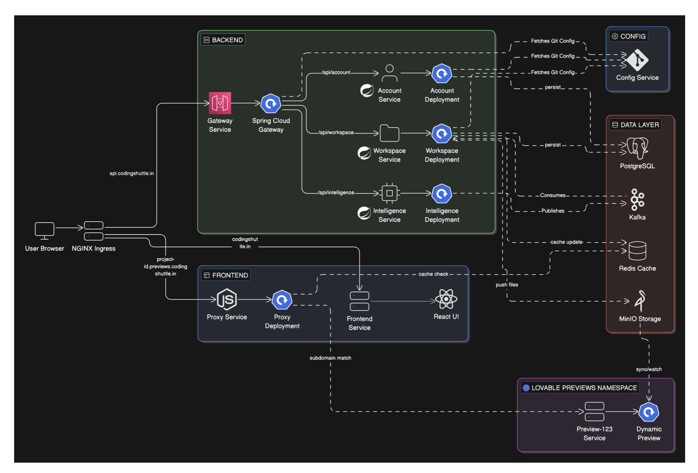
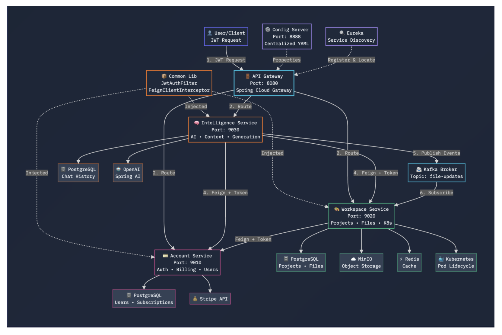

# Distributed Lovable

> A production-oriented backend for building, deploying, and iterating on applications with AI.

Distributed Lovable is a Spring-based microservice platform that turns natural-language prompts into project files and runnable previews. It combines authentication, billing, project and file management, AI-assisted code generation, asynchronous events, and Kubernetes preview environments behind a single API gateway.

The project is built to demonstrate the engineering required beyond an AI prompt box: service boundaries, independent data ownership, JWT propagation, authorization, streaming responses, externalized configuration, cloud deployment, and isolated preview infrastructure.

## Demo Walkthrough

https://github.com/user-attachments/assets/d3a02989-d61d-41ce-a620-3511658ec6da

## Why this architecture

The platform separates responsibilities instead of turning the entire product into one deployable application:

- **Account Service** owns identity, plans, subscriptions, and Stripe billing.
- **Workspace Service** owns projects, members, files, deployments, and preview orchestration.
- **Intelligence Service** owns AI conversations, context gathering, code generation, parsing, and usage tracking.
- **API Gateway** is the public edge for routing, CORS, and JWT validation.
- **Config Service** loads environment-specific configuration from a Git repository.
- **Discovery Service** provides Eureka-based service registration and discovery.
- **Common Library** centralizes security filters, DTOs, events, enums, and Feign authentication propagation.

The result is a backend where each domain can evolve and scale independently while preserving a consistent security and communication model.

## Architecture

Distributed Lovable runs on GKE with a public ingress layer, independently deployable backend services, stateful infrastructure, and isolated preview workloads.

### Platform and preview runtime



The public entry points are separated by hostname:

- `api.<domain>` routes to the Spring Cloud API Gateway.
- The primary domain routes to the frontend.
- `*.previews.<domain>` routes through the preview proxy to a dynamically deployed user preview.
- Preview workloads run in the dedicated `lovable-previews` namespace.

### Service interaction and AI generation flow



The API Gateway validates client JWTs and routes traffic to the Account, Workspace, and Intelligence services. Each backend service validates the token independently, and Feign calls forward the authenticated context between services.

The Intelligence Service gathers workspace context, invokes OpenAI through Spring AI, streams generated output, parses file/tool instructions, records usage, and publishes file update events. The Workspace Service persists files to MinIO and manages preview pod lifecycle through the Kubernetes API.

### Core request lifecycle

1. A client sends a request to the API Gateway through NGINX Ingress.
2. The gateway validates the JWT unless the route is configured as public.
3. The request is routed to the owning service.
4. The receiving service validates the JWT again and creates its local Spring Security context.
5. Feign clients propagate the authenticated bearer token for downstream calls.
6. Domain authorization is applied inside the service—for example, project edit permissions.
7. The Intelligence Service gathers workspace context, streams model output, parses generated file/tool instructions, and records chat usage.
8. The Workspace Service persists project files and coordinates Kubernetes preview workloads.

## Services

| Module | Responsibility | Main integrations |
| --- | --- | --- |
| `api-gateway` | Public API boundary, routing, CORS, edge JWT validation | Spring Cloud Gateway, Eureka |
| `account-service` | Signup, login, users, plans, subscriptions, Stripe | PostgreSQL, Stripe, JWT |
| `workspace-service` | Projects, members, file tree, file content, deployments | PostgreSQL, MinIO, Redis, Kubernetes API, Feign |
| `intellijence-service` | Streaming AI chat, context, code generation, parsing, usage | PostgreSQL, Spring AI/OpenAI, Feign, Kafka |
| `config-service` | Git-backed centralized configuration | Spring Cloud Config Server, GitHub |
| `discovery-service` | Service registration and discovery | Eureka Server |
| `common-lib` | Shared JWT security, DTOs, events, enums, Feign auth propagation | Spring Security, OpenFeign |
| `k8s/proxy` | Dynamic HTTP/WebSocket routing to previews | Node.js, Redis, `http-proxy` |

### Platform infrastructure

The Kubernetes manifests provision and connect:

- PostgreSQL with the `pgvector/pgvector:pg16` image
- Redis
- MinIO
- Kafka in KRaft mode
- NGINX Ingress
- Kubernetes RBAC for preview management
- Network policies for core and preview traffic
- A dedicated `lovable-previews` namespace for generated applications

## Repository structure

```text
.
├── account-service/       # Identity and billing
├── api-gateway/           # Public gateway and edge security
├── common-lib/            # Shared backend contracts and security
├── config-service/        # Git-backed Spring Config Server
├── discovery-service/     # Eureka Server
├── intellijence-service/  # AI chat and code generation
├── workspace-service/     # Projects, files, members, deployments
├── k8s/
│   ├── infra/             # Namespaces, ingress, RBAC, network policies
│   ├── stateful/          # PostgreSQL, Redis, MinIO, Kafka
│   ├── services/          # Kubernetes Deployments and Services
│   ├── proxy/             # Preview proxy
│   └── lovable-k8s.yaml   # Consolidated manifest
└── docs/architecture/     # Architecture images
```

There is no root Maven reactor. Each Java module is an independent Maven project. `common-lib` must be installed before compiling dependent services.

## Technology

- Java 21
- Spring Boot 4.1.0
- Spring Cloud 2025.1.2
- Spring AI 2.0.0
- Spring Security and JJWT
- Spring Cloud Gateway and Eureka
- Spring Data JPA
- OpenFeign
- PostgreSQL / pgvector
- Redis, MinIO, and Kafka
- Kubernetes and Google Kubernetes Engine
- Maven Wrapper per Java service

## Prerequisites

For local development:

- JDK 21
- Git
- Docker or access to the required infrastructure
- Access to the Git-backed configuration repository
- OpenAI-compatible API credentials for AI generation
- Stripe credentials for billing flows

For GKE deployment:

- `gcloud`
- `kubectl`
- Access to the target GCP project and cluster
- Permissions to create namespaces, workloads, RBAC, ingress, and persistent volumes

## Configuration

The application services import configuration from Spring Cloud Config:

```yaml
spring:
  config:
    import: configserver:${CONFIG_SERVER_URL:http://localhost:8888}
```

`config-service/src/main/resources/application.yaml` points to the Git-backed configuration repository. Keep credentials in environment variables or Kubernetes Secrets; never commit them to either repository.

### Kubernetes Secret

The manifests expect a Secret named `app-secrets` in the `lovable-core` namespace. The referenced keys are:

| Key | Used by |
| --- | --- |
| `GIT_USERNAME` | Config Service |
| `GIT_PASSWORD` | Config Service |
| `POSTGRES_PASSWORD` | PostgreSQL |
| `ACCOUNT_DB_PASSWORD` | Account Service / PostgreSQL initialization |
| `WORKSPACE_DB_PASSWORD` | Workspace Service / PostgreSQL initialization |
| `INTELLIGENCE_DB_PASSWORD` | Intelligence Service / PostgreSQL initialization |
| `JWT_SECRET` | Gateway and backend JWT validation |
| `STRIPE_API_KEY` | Account Service |
| `STRIPE_WEBHOOK_SECRET` | Account Service |
| `AI_API_KEY` | Intelligence Service |
| `MINIO_ROOT_USER` | MinIO / Workspace Service |
| `MINIO_ROOT_PASSWORD` | MinIO / Workspace Service |

The gateway and every service that verifies tokens must use the same JWT secret.

### Shared ConfigMap

`k8s/infra/namespaces.yaml` defines `lovable-shared-config` with values for:

- `PREVIEW_DOMAIN`
- `PREVIEW_NAMESPACE`
- `PROXY_PORT`
- `APP_FRONTEND_URL`

Update these values and the hostnames in `k8s/infra/ingress.yaml` for a different environment.

## Build and test

Build and install the shared library first:

```bash
cd common-lib
./mvnw clean install
cd ..
```

Build or test an individual service:

```bash
cd account-service
./mvnw clean verify
```

Build all Java modules in dependency order:

```bash
for service in common-lib discovery-service config-service api-gateway account-service workspace-service intellijence-service; do
  (cd "$service" && ./mvnw clean verify)
done
```

Each service also contains a Maven Wrapper, so a system-wide Maven installation is not required.

## Run locally

Start dependencies first, then the services in this order:

1. PostgreSQL, Redis, MinIO, and Kafka
2. `discovery-service` on port `8761`
3. `config-service` on port `8888`
4. `api-gateway`
5. `account-service`, `workspace-service`, and `intellijence-service`
6. The preview proxy, when testing preview routing

Example:

```bash
cd discovery-service
./mvnw spring-boot:run
```

The default Config Server URL is `http://localhost:8888`. Override it when needed:

```bash
export CONFIG_SERVER_URL=http://localhost:8888
```

This repository does not currently include a root Docker Compose file. Local infrastructure must be started separately or accessed through a development environment connected to the deployed dependencies.

## API reference

Use the API Gateway for client requests. Protected requests require:

```http
Authorization: Bearer <jwt>
```

The gateway returns `401 Unauthorized` when a protected request has no valid bearer token. Public route configuration is loaded through Config Server.

### Authentication

#### Sign up

```http
POST /auth/signup
Content-Type: application/json
```

```json
{
  "username": "developer@example.com",
  "name": "Developer",
  "password": "strong-password"
}
```

`username` must be an email. `name` is limited to 30 characters and `password` is limited to 4–50 characters.

#### Log in

```http
POST /auth/login
Content-Type: application/json
```

```json
{
  "username": "developer@example.com",
  "password": "strong-password"
}
```

Response shape:

```json
{
  "token": "<jwt>",
  "user": {}
}
```

The profile fields are defined by `UserProfileResponse`.

### Projects

```http
GET /projects
Authorization: Bearer <jwt>
```

```http
POST /projects
Authorization: Bearer <jwt>
Content-Type: application/json
```

```json
{
  "name": "My generated application"
}
```

Available project operations:

| Method | Endpoint | Description |
| --- | --- | --- |
| `GET` | `/projects` | List the current user's projects |
| `GET` | `/projects/{id}` | Get a project |
| `POST` | `/projects` | Create a project |
| `PATCH` | `/projects/{id}` | Update a project |
| `DELETE` | `/projects/{id}` | Soft-delete a project |
| `POST` | `/projects/{id}/deploy` | Deploy a project to the preview runtime |

### Files

```http
GET /projects/{projectId}/files
Authorization: Bearer <jwt>
```

```http
GET /projects/{projectId}/files/content?path=src/App.jsx
Authorization: Bearer <jwt>
```

The workspace service exposes a file tree and individual file content backed by MinIO.

### Project members

| Method | Endpoint | Description |
| --- | --- | --- |
| `GET` | `/projects/{projectId}/members` | List members |
| `POST` | `/projects/{projectId}/members` | Invite a member |
| `PATCH` | `/projects/{projectId}/members/{memberId}` | Update a member role |
| `DELETE` | `/projects/{projectId}/members/{memberId}` | Remove a member |

Request fields for invitations and role updates are defined by `InviteMemberRequest` and `UpdateMemberRoleRequest`.

### AI chat and code generation

The AI endpoint uses Server-Sent Events:

```http
POST /chat/stream
Authorization: Bearer <jwt>
Content-Type: application/json
Accept: text/event-stream
```

```json
{
  "message": "Create a landing page for a coffee subscription service",
  "projectId": 42
}
```

Each event contains a `StreamResponse`:

```text
data:{"text":"..."}
```

The intelligence service gathers the project file tree, checks account limits, executes the model request, parses generated `<file>` and tool instructions, and persists chat/usage events.

Get project chat history:

```http
GET /chat/projects/{projectId}
Authorization: Bearer <jwt>
```

### Billing

Get the current subscription:

```http
GET /api/me/subscription
Authorization: Bearer <jwt>
```

Create a Stripe Checkout session:

```http
POST /api/payments/checkout
Authorization: Bearer <jwt>
Content-Type: application/json
```

```json
{
  "planId": 2
}
```

Response:

```json
{
  "checkoutUrl": "https://checkout.stripe.com/..."
}
```

Open the customer portal:

```http
POST /api/payments/portal
Authorization: Bearer <jwt>
```

Stripe webhook:

```http
POST /webhooks/payment
Stripe-Signature: <stripe-signature>
Content-Type: application/json
```

The webhook signature is verified using `STRIPE_WEBHOOK_SECRET`.

## Security model

Security is enforced twice by design:

1. **Gateway security** validates the JWT before protected traffic enters the platform.
2. **Service security** validates the JWT again using `common-lib` and establishes the local Spring Security context.

This prevents internal services from trusting network location alone. Feign clients propagate the authenticated bearer token so downstream calls preserve user identity and authorization context.

Project-level authorization is handled inside the workspace and intelligence flows. Operations such as editing a project or generating code are checked against the user's project permissions rather than relying only on authentication.

## Kubernetes and GKE deployment

The manifests use two namespaces:

- `lovable-core` for services and infrastructure
- `lovable-previews` for generated preview workloads

### 1. Connect to GKE

```bash
gcloud container clusters get-credentials <cluster-name> \
  --region <region> \
  --project <project-id>

kubectl get nodes
```

### 2. Create namespaces and shared configuration

```bash
kubectl apply -f k8s/infra/namespaces.yaml
```

Create the application Secret from a local, untracked environment file:

```bash
kubectl create secret generic app-secrets \
  --from-env-file=.env \
  -n lovable-core
```

Apply RBAC and network policies:

```bash
kubectl apply -f k8s/infra/core-network-policies.yaml
kubectl apply -f k8s/infra/preview-network-policies.yaml
```

### 3. Deploy stateful infrastructure

```bash
kubectl apply -f k8s/stateful/ -n lovable-core
kubectl get pods -n lovable-core -w
```

Wait for PostgreSQL, Redis, MinIO, and Kafka to become ready before starting application services.

### 4. Deploy application services

```bash
kubectl apply -f k8s/services/ -n lovable-core
kubectl apply -f k8s/proxy/proxy-deployment.yaml -n lovable-core
```

### 5. Configure ingress

```bash
kubectl apply -f k8s/infra/ingress.yaml -n lovable-core
kubectl get ingress -n lovable-core
```

The current ingress routes:

- `breezestack.in` and `www.breezestack.in` → frontend
- `api.breezestack.in` → API Gateway
- `*.previews.breezestack.in` → preview proxy

Point DNS records to the external address assigned to the NGINX ingress controller. Change the hostnames in `k8s/infra/ingress.yaml` for another environment.

The repository also contains `k8s/lovable-k8s.yaml`, a consolidated manifest. Use either the split manifests or the consolidated file for a deployment; do not apply both sets as they define overlapping resources.

### Verify a rollout

```bash
kubectl get deployments -n lovable-core
kubectl get services -n lovable-core
kubectl rollout status deployment/api-gateway -n lovable-core
kubectl logs deployment/api-gateway -n lovable-core
```

## Preview runtime

The workspace service manages preview workloads in `lovable-previews`. The Node.js proxy resolves a preview hostname from Redis using:

```text
route:<hostname>
```

It supports both HTTP and WebSocket traffic and defaults to port `5173` when Redis stores only a host or service name.

- Missing Redis route → `404`
- Preview target unavailable → `502`
- Preview workloads are isolated in a separate namespace
- Workspace uses a dedicated service account and RBAC binding to manage preview pods

## Troubleshooting

### Config Server startup failure

Check that:

- `config-service` is running on port `8888`.
- `CONFIG_SERVER_URL` is correct.
- The Git-backed configuration repository is reachable.
- `GIT_USERNAME` and `GIT_PASSWORD` are available to Config Service.
- The repository contains configuration for the expected service name/profile.

### `401 Unauthorized`

Check that:

- The request includes `Authorization: Bearer <jwt>`.
- Gateway and backend services use the same `JWT_SECRET`.
- The token is valid and not expired.
- The route is not incorrectly configured as protected or public.

### Feign call failure

Check service registration, Eureka connectivity, internal service names, network policies, and whether the Feign interceptor is forwarding the bearer token.

### AI stream failure

Check `AI_API_KEY`, model configuration, project permissions, workspace file access, database connectivity, and that the client accepts `text/event-stream`.

### Preview `404` or `502`

Check the Redis key `route:<hostname>`, preview pod status, port `5173`, namespace network policies, wildcard DNS, and proxy logs.

### Pods stuck in `Pending`

```bash
kubectl describe pod <pod-name> -n lovable-core
kubectl get pvc -n lovable-core
kubectl get events -n lovable-core --sort-by=.lastTimestamp
```

## Engineering conventions

- Keep domain logic in the service that owns it.
- Share DTOs and events across boundaries; do not expose JPA entities between services.
- Put genuinely cross-cutting security and transport behavior in `common-lib`.
- Treat Config Server and Kubernetes Secrets as runtime configuration.
- Never commit JWT, Stripe, GitHub, MinIO, database, or AI credentials.
- Update endpoint documentation when controller contracts change.
- Keep Kubernetes manifests separated by concern and review RBAC/network-policy changes carefully.

## Project status

Distributed Lovable is an actively developed backend platform. The service boundaries, security model, AI generation flow, Kubernetes runtime, and deployment manifests are implemented in this repository. Hostnames, image tags, model settings, and Git-backed configuration remain environment-specific.
